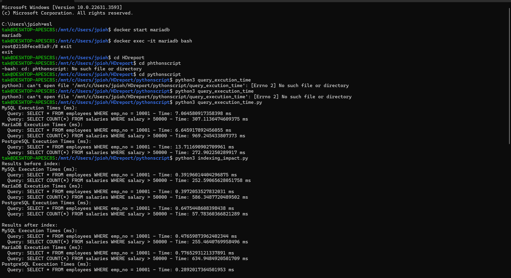
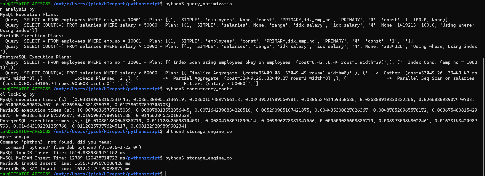
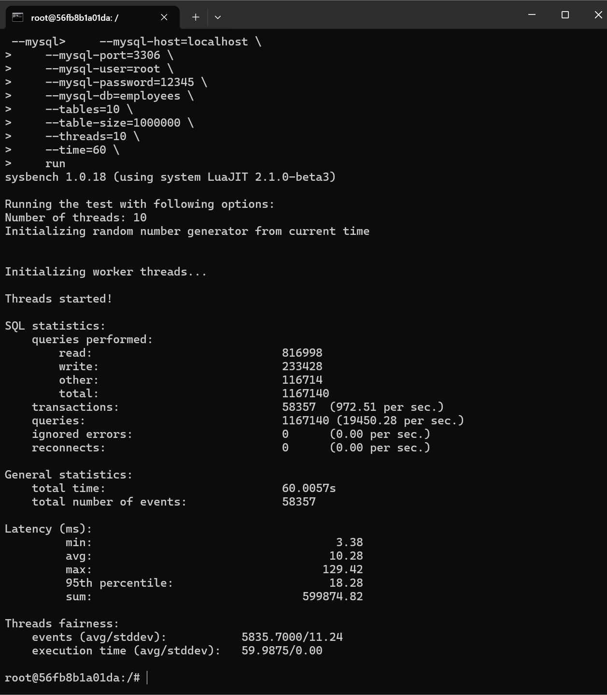
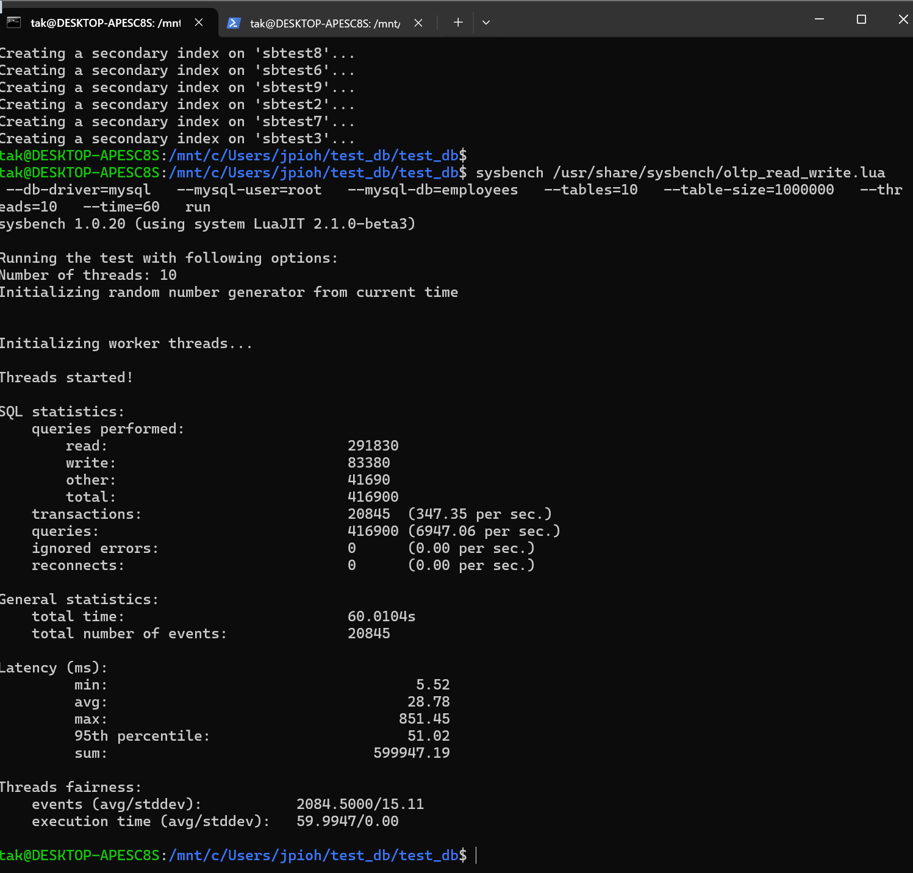
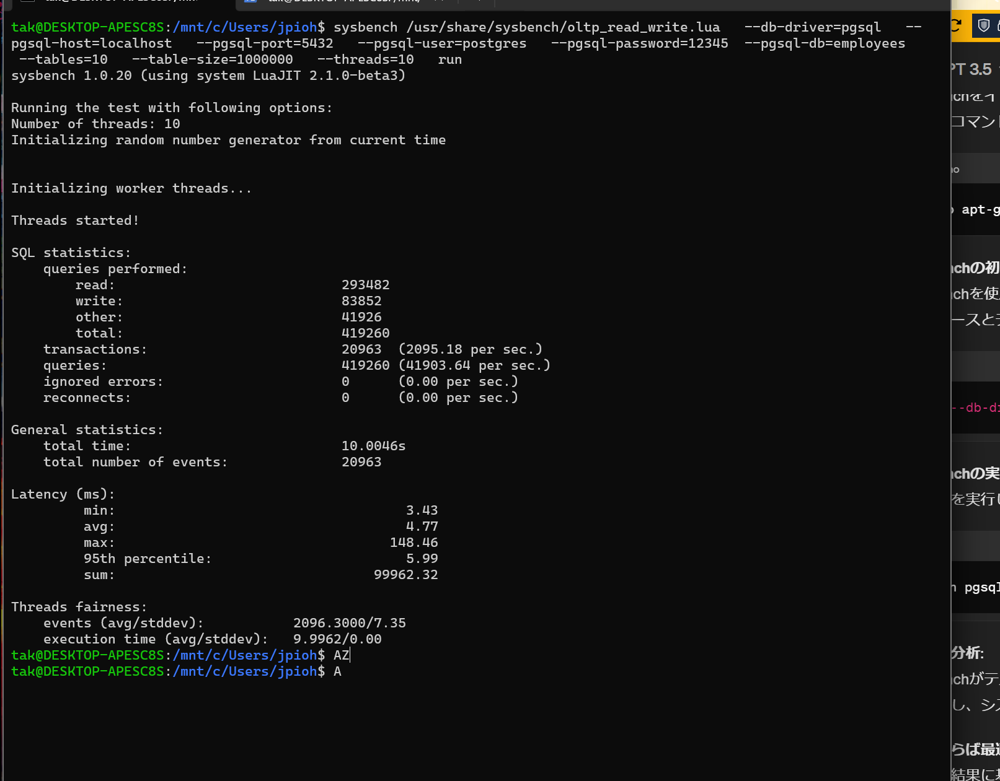

# RDBMS Performance Comparison – MySQL, MariaDB, PostgreSQL

This repository documents a benchmarking project comparing the performance of three widely used relational database systems — **MySQL**, **MariaDB**, and **PostgreSQL** — under a variety of read/write workloads using Docker containers on WSL. The benchmarks were conducted using Python scripts and Sysbench to automate query execution and concurrency testing.

---

## 📂 Contents

- Docker-based experimental setup (WSL + Sysbench)
- Query execution time (with/without indexing)
- Concurrency performance benchmarking
- Insert performance across storage engines (InnoDB, MyISAM)
- Execution plan (EXPLAIN) analysis

---

## 📝 Project Summary

This benchmarking project aimed to explore how common factors such as **indexing**, **storage engine type**, and **concurrent workload levels** influence the performance of relational databases.

### Scope of Testing:
- **SELECT and COUNT queries** on large tables (1M rows) with and without indexing.
- **INSERT throughput** across different storage engines (InnoDB, MyISAM).
- **Concurrency simulation** using 10 threads over a 60-second Sysbench OLTP workload.
- **Execution plan analysis** using EXPLAIN outputs from each database engine.

### Key Findings:

- 🔹 **MariaDB** performed best in simple indexed SELECT queries.
- 🔹 **PostgreSQL** excelled in high-concurrency conditions and aggregate queries, showing consistent low-latency performance.
- 🔹 **MySQL** delivered average results, heavily dependent on the storage engine used.
- 🔹 Indexing improved performance across all engines, especially for COUNT-based queries.
- 🔹 Storage engine selection (e.g., MyISAM vs InnoDB) significantly affected INSERT performance and latency.

---

## 📸 Benchmark Screenshots

### 🔹 Query Execution Time & Index Impact

  
> SELECT performance before and after indexing across MySQL, MariaDB, and PostgreSQL.

---

### 🔹 Query Plan Analysis & Insert Time

  
> Execution plan differences and INSERT speed comparison across storage engines.

---

### 🔹 Sysbench - MariaDB

  
> MariaDB: ~58,357 transactions in 60s, average latency ~10.28ms (10 threads).

---

### 🔹 Sysbench - MySQL

  
> MySQL: ~20,845 transactions in 60s, average latency ~28.78ms (10 threads).

---

### 🔹 Sysbench - PostgreSQL

  
> PostgreSQL: ~20,963 transactions, average latency ~4.77ms — lowest among all three engines.

---

## 📄 Report

The full experimental methodology and results are documented in a private report.  
To request access for educational or portfolio review purposes, please contact the repository owner.

---

## 📜 License

**Educational Use Only**

This repository is intended for educational and portfolio purposes only.  
All content is original and reconstructed from personal experimentation.  
No official university content (assignments, grading rubrics, or briefs) is included.

You may not copy, redistribute, or use this material for commercial or academic cheating purposes.
